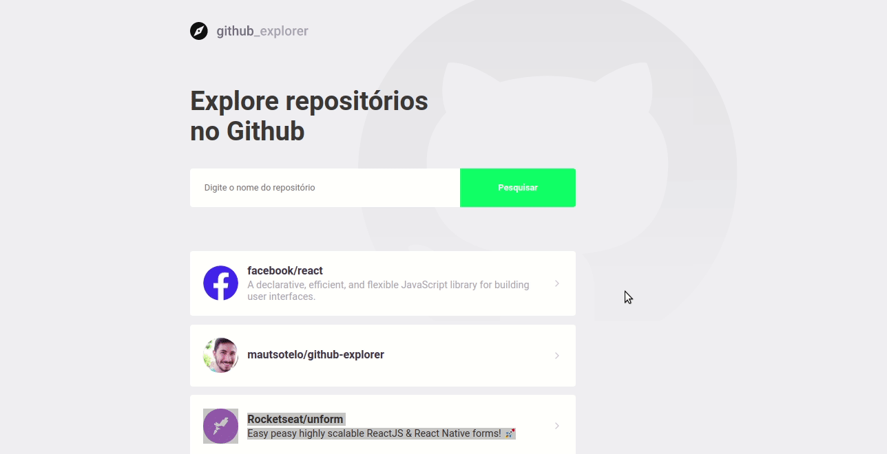

This project was bootstrapped with [Create React App](https://github.com/facebook/create-react-app).

# Introduction

Github Explorer is an application that helps you explore users repositories. This project was created to learn new technologies.

Watch the GIF below to get an idea of how it is:

## Installing

In the project directory, you can run:
> $ yarn

This command will install all the dev dependencies that the project needs.
> $ yarn start

This command will run the app in the development mode. 
Open [http://localhost:3000](http://localhost:3000) to view it in the browser.

The page will reload if you make edits. 
You will also see any lint errors in the console.

## Build With (Tech Stack)

* ReactJS
* Typescript
* Prettier
* ESLint

## License

This project is licensed under the MIT License - see the [LICENSE.md] file for details

